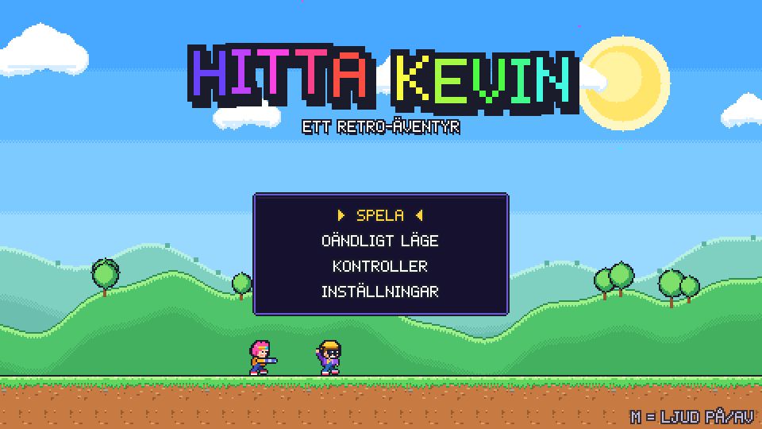
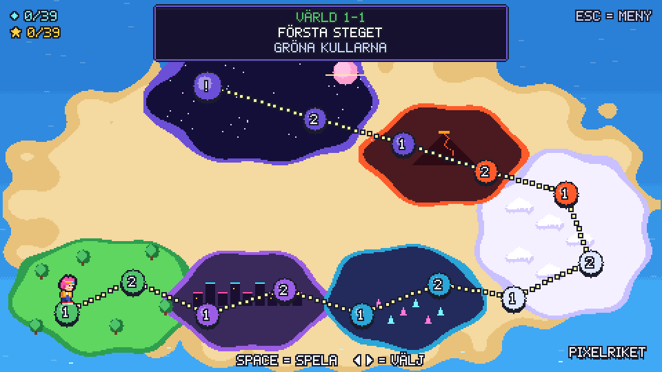
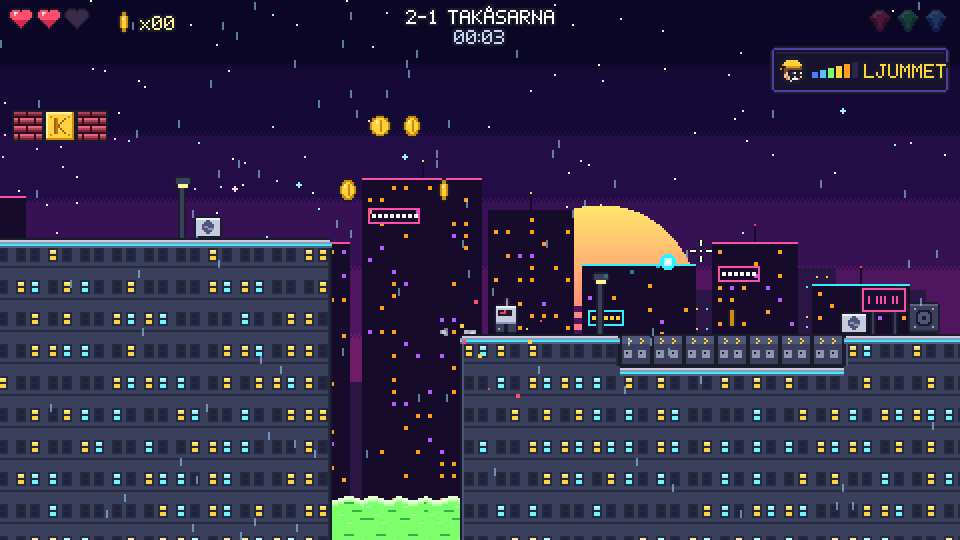
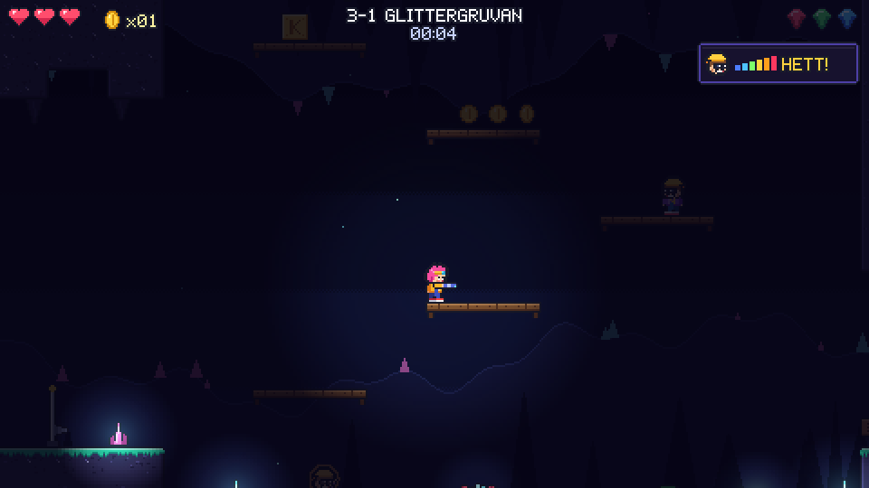

# HITTA KEVIN

Ett färgglatt retro-plattformsspel. Kevin har gömt sig någonstans i Pixelriket.
Spring, hoppa, skjut, flyg med jetpack och spana med kikaren tills du hittar honom.
Se upp för Papp-Kevins!

- **13 banor i sex världar**: Gröna Kullarna, Neonstaden, Kristallgrottan, Molnriket,
  Lavaslottet och Rymden. Sista banan är en bossfight mot Robo-Kevin.
- **Hitta Kevin**: Kevin gömmer sig bakom hemliga väggar, på höga avsatser och i mörka
  grottor. Ibland smiter han iväg till ett nytt gömställe när du kommer nära.
- **Kikare**: stå still och spana över hela banan. I mörka grottor ser kikaren bättre.
- **Kevin-radar**: visar hur nära du är: KALLT, LJUMMET, VARMT eller HETT!
- **Papp-Kevins**: lockbeten i kartong. Den riktiga Kevin rör sig och blinkar.
- **Jetpack, sköld, trippelskott, myntmagnet och disco-läge** (oövervinnlig i tio sekunder).
- **Tre diamanter per bana** och tre stjärnor att samla: hitta Kevin, ta alla diamanter
  och klara banan på under par-tiden.
- **Oändligt läge**: nya slumpade banor i all oändlighet. Hitta Kevin innan tiden
  tar slut, varje Kevin ger mer tid, och slå ditt rekord.
- Egen chiptune-musik för varje värld, pixelgrafik och en karta över Pixelriket.
- Framstegen sparas automatiskt i webbläsaren.

| | |
| --- | --- |
|  |  |
|  |  |

## Spela

Inget behöver installeras och spelet fungerar utan internet.

1. Ladda ner repot (på GitHub: **Code → Download ZIP**, eller `git clone`).
2. Dubbelklicka på **`index.html`**, så öppnas spelet i webbläsaren.

Spelet fungerar i Chrome, Edge, Firefox och Safari, både på datorn och i mobilen
(håll mobilen liggande).

## Kontroller

| Tangentbord och mus | Vad det gör |
| --- | --- |
| **A / D** (eller ← →) | Springa |
| **Space** | Hoppa. Håll in för högre hopp. |
| **Musklick** | Skjut dit musen pekar |
| **E** eller **högerklick** | Kikare: stå still och spana (flytta musen eller WASD) |
| **W / S** | Titta upp och ner, huka och krypa |
| **S + Space** | Hoppa ner genom plankor |
| **Shift** | Sprinta |
| **Space i luften** | Flyg med jetpack (när du har en) |
| **J** | Skjut utan mus (siktar automatiskt) |
| **Esc / P** | Paus |
| **R** | Starta om banan |
| **M** | Ljud på/av |

**Mobil:** pilknappar, HOPP, SKJUT och KIKARE visas på skärmen. Tryck var som helst
i spelet för att skjuta dit.

**Handkontroll:** vänster spak för att gå, A för att hoppa, X eller RT för att skjuta
(höger spak siktar), Y för kikaren och Start för paus.

## Tips

- Blir radarn HETT men du ser inte Kevin? Då är han troligen bakom en vägg. Gå rakt in
  i den.
- Spruckna väggar och golv går att skjuta sönder, och bakom dem finns ofta diamanter.
- Svävande mynt i luften kan betyda osynliga block. Hoppa upp under dem.
- Håll inne hopp när du landar på en studsmatta så flyger du mycket högre.
- 50 mynt ger ett extra hjärta.

## För utvecklare

Allt är vanlig JavaScript med canvas och inga beroenden. Grafik och ljud skapas i kod
(pixelkonst ritas med en liten "painter", musiken spelas av en egen WebAudio-sequencer).

```
index.html            startsidan
js/engine.js          spel-loop, skalning, scener, övergångar
js/input.js           tangentbord, mus, touch, handkontroll
js/art.js             all pixelkonst (hjälten, Kevin, fiender, föremål)
js/themes.js          världarnas färger och parallax-bakgrunder
js/tiles.js           rutor/tiles per värld
js/level.js           tolkning av nivåkartor, kollisioner, dekor
js/player.js          spelaren: hopp, jetpack, skjutning, kikare
js/enemies.js         fiender och bossen Robo-Kevin
js/entities.js        föremål, plattformar, Kevin och Papp-Kevins
js/world.js           allt som händer i en bana
js/scenes.js          titel, berättelse, karta, paus, resultat, slut
js/audio.js           ljudeffekter och musik
js/levels/worldN.js   nivåerna (genererade, se nedan)
tools/                verktyg för nivåer och test
```

Nivåerna skrivs i `tools/levelgen/wN.js` och byggs till `js/levels/`:

```sh
node tools/levelgen/build.js     # bygg alla nivåer
node tools/validate.js           # kontrollera att Kevin och alla diamanter går att nå
node tools/validate-endless.js   # samma kontroll för slumpade banor i oändligt läge
node tools/test-movers.js        # går det att hoppa från alla rörliga plattformar? (Playwright)
node tools/monkey.js 1-1 2-1     # slumpade knapptryck i webbläsaren, letar efter fel (Playwright)
```

`tools/validate.js` simulerar spelarens riktiga fysik från alla ställen man kan stå på
och varnar om något i en bana inte går att nå. `tools/overview.html?level=1-1` ritar en
hel bana som en bild.

Felsökning via adressfältet: `index.html?level=3-2` startar direkt på en bana och
`index.html?scene=map&unlock=1` låser upp hela kartan.

---

En idé av Kevin. Kod, pixelkonst och chiptune: Claude.
